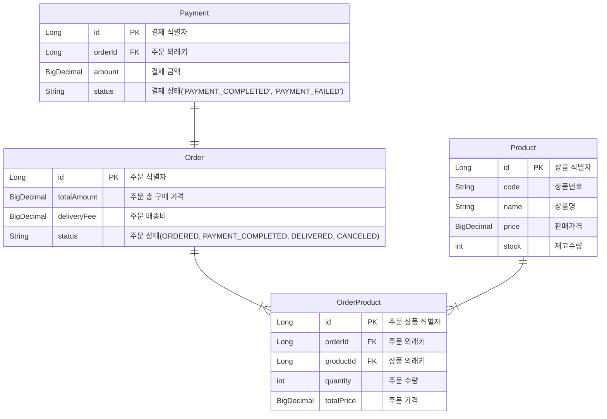
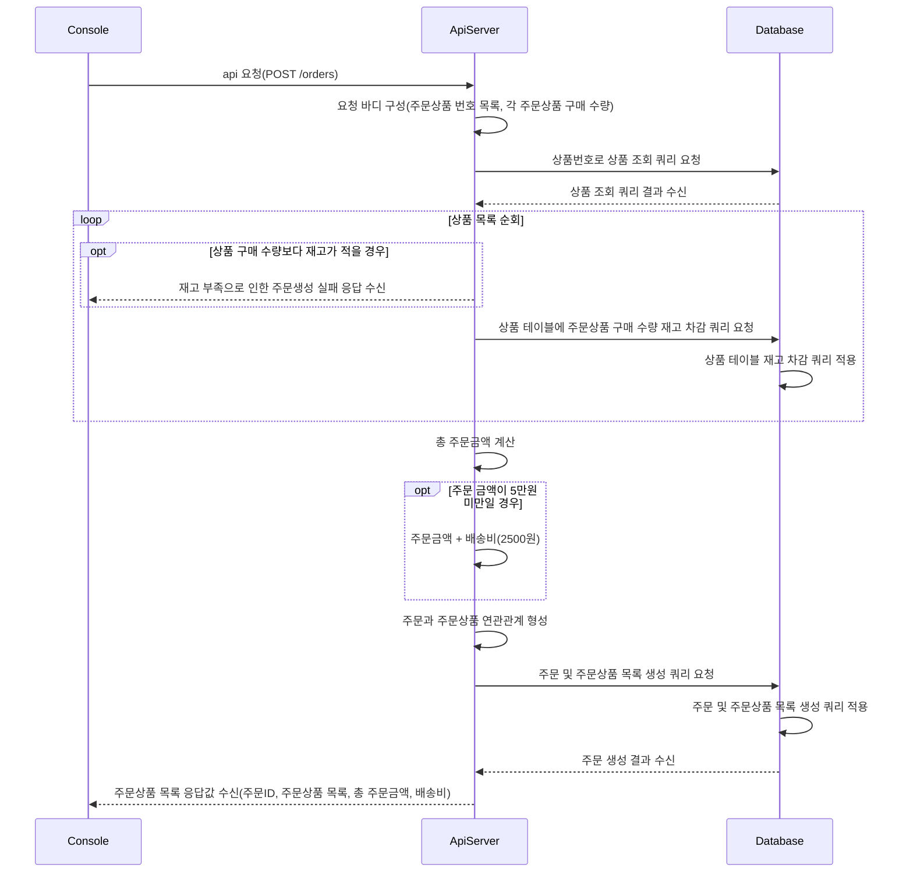
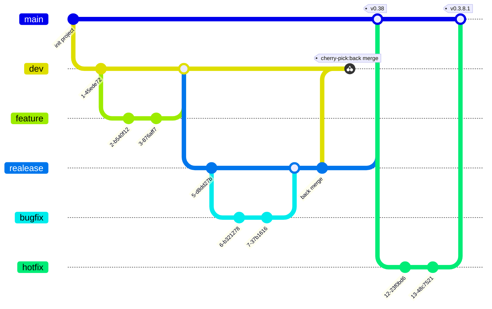

## ERD

**mermaid**
[https://mermaid.js.org/](https://mermaid.js.org/)
JS 기반의 다이어그램 및 차트 툴

**특징**
- md문서에 mermaid 문법에 맞게 텍스트를 작성하면, 그에 맞는 다이어그램 이미지를 출력한다.
- md를 지원하는 플랫폼은 별도의 플러그인을 설치할 필요가 없다.
    - github, notion의 경우 md 문서의 codespace를 통해 바로 적용이 가능하다.

**장점**
- 텍스트만 바꾸면 바로 반영이 가능하므로, 문서 최신화가 용이하다.
- 직관적인 문법으로 구성이 되어, 구상과 동시에 설계가 가능할 수 있다.

**단점**
- 각 구성요소간의 연결선들을 직접 조작할 수 없기 때문에, 일부 다이어그램은 구성이 복잡해질수록 가독성이 떨어질 수 있다.
- 일부 다이어그램은 비개발직군에게는 오히려 기존방식보다 진입장벽이 높을 수 있다.
- mermaid를 지원하지 않는 플랫폼에서는 오히려 사용이 불편할 수 있다.
## ERD

## SequenceDiagram
**주문 생성 api**

## Git

